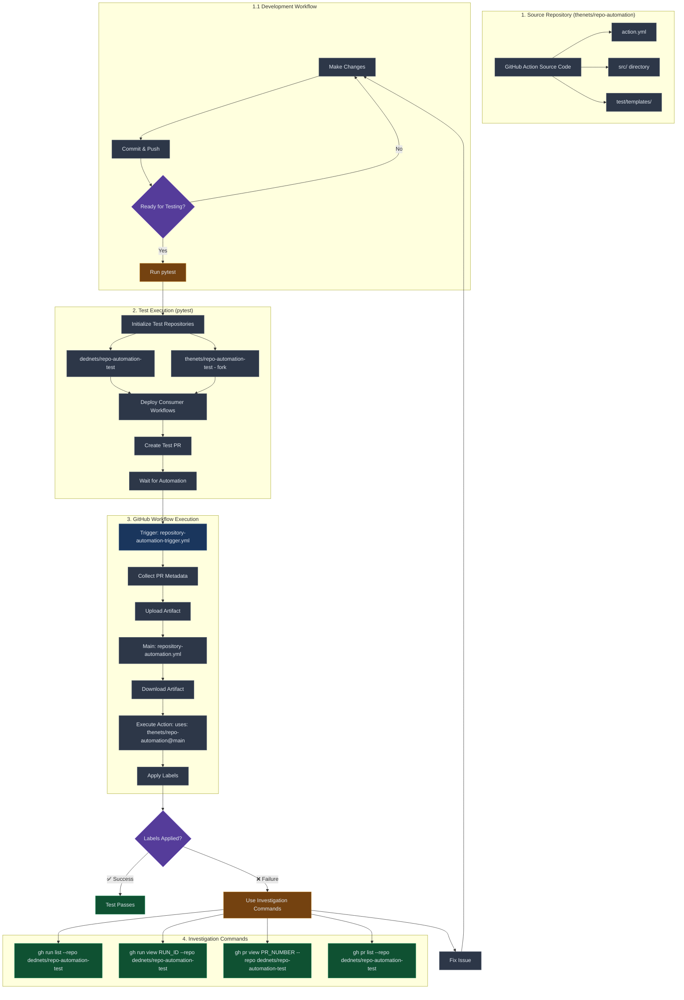

# GitHub Repository Automations - Claude Instructions

## Project Overview

This repository contains GitHub Actions workflows for automating repository management tasks, specifically focused on triage label management for issues and pull requests.

## Current Features

1. **Auto-Add Triage Label**: Automatically adds "triage" label to new issues and PRs
2. **Triage Label Protection**: Prevents removal of "triage" label unless "release-*" or "backport-*" labels are present
3. **Stale PR Detection**: Automatically marks PRs as stale when inactive for more than 1 day
4. **Title-Label Sync**: Bi-directional sync between PR titles and labels for POC, WIP, and HOLD status indicators

## Development Guidelines

### Workflow Structure
- All GitHub Actions workflows go in `.github/workflows/`
- Use descriptive filenames: `keeper-auto-add-triage-label.yml`, `keeper-triage-label-protection.yml`, `keeper-stale-pr-detector.yml`
- Follow YAML best practices for GitHub Actions

### Testing Commands
```bash
# Validate YAML syntax and formatting (run this before committing workflow changes)
make lint

# Run specific test class
./venv/bin/pytest test/test_triage_auto_add.py::TestStalePRDetector

# Run specific individual test
./venv/bin/pytest test/test_triage_auto_add.py::TestStalePRDetector::test_stale_pr_detection_manual_trigger -v

# Run tests with verbose output
./venv/bin/pytest -v

# Run tests and show print statements
./venv/bin/pytest -s

# If I pass a test name only to be executed, use the `-k` pytest arg to auto select this test
```

### Pre-Commit Guidelines
- Always run `make lint format" before commiting git changes

### Key Implementation Notes

1. **Label Management**:
   - Always check if "triage" label exists before adding
   - Handle API rate limits gracefully
   - Use `GITHUB_TOKEN` for authentication

2. **Event Triggers**:
   - Auto-add: `issues.opened`, `pull_request.opened`
   - Protection: `issues.labeled`, `issues.unlabeled`, `pull_request.labeled`, `pull_request.unlabeled`
   - Stale detection: `schedule` (daily cron), `workflow_dispatch` (manual trigger)

3. **Pattern Matching**:
   - Release labels: `release-*` (e.g., "release-1.0", "release-v2.3")
   - Backport labels: `backport-*` (e.g., "backport-1.0", "backport-main")

4. **Stale Detection Logic**:
   - Runs daily at 2 AM UTC
   - Checks all open PRs for activity in the last 24 hours
   - Activity includes: commits, comments, reviews, label changes, status changes
   - Only adds "stale" label if not already present
   - Skips PRs that already have stale label

5. **Title-Label Sync Logic**:
   - **Title is source of truth**: Title changes always override labels
   - Triggers on: `pull_request.edited`, `pull_request.labeled`, `pull_request.unlabeled`
   - Supports status indicators: `[POC]`, `[WIP]`, `[HOLD]` (case-insensitive)
   - Labels are always lowercase: `poc`, `wip`, `hold`
   - Status brackets can appear anywhere in title
   - Multiple indicators supported: `[WIP][HOLD] Feature`
   - Enabled by default (opt-out with `enable-title-label-sync: false`)
   - Skips draft PRs
   - Implementation files:
     - `src/title-label-sync.js` - Main sync module
     - `src/utils/title-parser.js` - Title parsing utilities
     - `src/utils/github-client.js` - PR title update methods
   - Test file: `test/test_title_label_sync.py`

### Required Permissions
GitHub Actions workflows need these permissions:
```yaml
permissions:
  issues: write
  pull-requests: write
```

### Error Handling
- Handle missing labels gracefully
- Log meaningful error messages
- Fail silently on permission issues to avoid noise

### File Organization
```
.github/workflows/
├── keeper-auto-add-triage-label.yml     # Auto-adds triage label to new issues/PRs
├── keeper-triage-label-protection.yml   # Protects triage label from removal
└── keeper-stale-pr-detector.yml         # Marks inactive PRs as stale
```

## Common Tasks

### Adding New Automation
1. Create new workflow file in `.github/workflows/`
2. Update README.md with feature documentation
3. Add testing scenarios
4. Update this CLAUDE.md if needed

### Modifying Existing Workflows
1. Always run `make lint` to validate YAML syntax and formatting before committing
2. Consider backward compatibility
3. Update documentation if behavior changes

### Debugging Workflows
- Use `gh run list --repo OWNER/REPO` to check GitHub Actions logs
- Use `gh run view RUN_ID --repo OWNER/REPO` for detailed log investigation
- Use `gh repo view OWNER/REPO` to verify webhook events and repository settings
- Use `gh label list --repo OWNER/REPO` to ensure required labels exist

## Repository Setup Requirements

1. **Labels**: Ensure required labels exist in repository settings:
   - "triage" (for new issues/PRs)
   - "stale" (for inactive PRs)
   - "poc", "wip", "hold" (for title-label sync)
2. **Actions**: Enable GitHub Actions if not already enabled
3. **Permissions**: Verify Actions have appropriate permissions
4. **Branch Protection**: Consider if workflows need to run on protected branches
5. **Repository Restriction**: Update `if: github.repository == 'your-org/your-repo'` in all workflows

## Testing and Debugging Workflows

### Investigation Loop for Workflow Failures

When workflows fail, follow this systematic debugging loop using the gh CLI:

```bash
# 1. Check latest workflow runs in test repository
gh run list --repo dednets/repo-automation-test --limit 1 --json databaseId,status,conclusion,name,workflowName,createdAt,url

# 2. If failure found, investigate specific run details
gh run view <RUN_ID> --repo dednets/repo-automation-test --log

# 3. Check recent PRs to understand context
gh pr list --repo dednets/repo-automation-test --state open --limit 5

# 4. Plan and implement fix, then repeat until workflows work
```

### Basic Architecture Flow - Fork Repository Testing



### Critical Testing Requirements

**⚠️ IMPORTANT: Changes must be committed and pushed before running pytest**

1. **This repository is the GitHub Action source code**
   - `action.yml` defines the action interface
   - `src/` contains the implementation
   - `test/templates/` contain consumer workflow templates

2. **Any changes must be pushed before testing**
   ```bash
   # Always commit and push first
   git add .
   git commit -m "your changes"
   git push origin main
   
   # Then run tests
   ./venv/bin/pytest test/test_basic_functionality.py::TestBasicFunctionality::test_hello -v
   ```

3. **Use gh CLI for investigation**
   ```bash
   # Check workflow runs
   gh run list --repo dednets/repo-automation-test --limit 5
   
   # Investigate failures
   gh run view <FAILED_RUN_ID> --repo dednets/repo-automation-test
   
   # Check PRs and labels
   gh pr list --repo dednets/repo-automation-test --state open
   gh pr view <PR_NUMBER> --repo dednets/repo-automation-test
   ```

### Test Repository Architecture

The test setup creates consumer repositories that use this action:

```yaml
# Consumer workflow in test repository
- name: Repository Automation
  uses: thenets/repo-automation@main  # References THIS repository
  with:
    github-token: ${{ secrets.GITHUB_TOKEN }}
    accepted-releases: '["1.0", "2.0"]'
```

This ensures end-to-end testing of the GitHub Action in real repository scenarios.

## GitHub CLI Guidelines

**⚠️ ALWAYS use the GitHub CLI (gh) for any GitHub.com interactions**

Instead of visiting GitHub.com in a browser, use these commands:
- **Repository info**: `gh repo view OWNER/REPO`
- **Issues**: `gh issue list --repo OWNER/REPO`, `gh issue view NUMBER --repo OWNER/REPO`
- **Pull requests**: `gh pr list --repo OWNER/REPO`, `gh pr view NUMBER --repo OWNER/REPO`
- **Workflow runs**: `gh run list --repo OWNER/REPO`, `gh run view RUN_ID --repo OWNER/REPO`
- **Releases**: `gh release list --repo OWNER/REPO`, `gh release view TAG --repo OWNER/REPO`
- **Labels**: `gh label list --repo OWNER/REPO`
- **API access**: `gh api repos/OWNER/REPO/endpoint`

## Documentation Guidelines

- New feature plans must be documented into the README.md