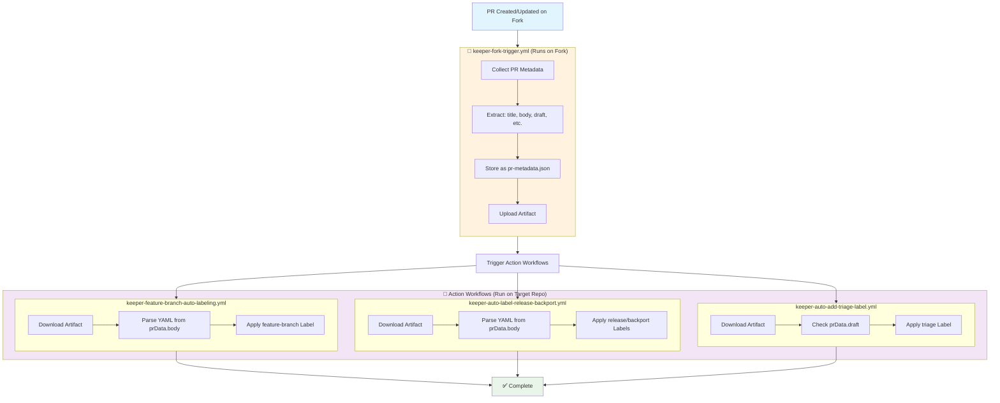

# Fork-Compatible GitHub Actions Workflow Plan

## Overview

This plan outlines the redesign of GitHub Actions workflows to support external contributors working from forks. The current design requires repository secrets for labeling operations, which are not available to workflows running on forks for security reasons.

## Problem Statement

Current workflows fail when triggered by pull requests from forks because:
- Forked repositories don't have access to the original repository's secrets
- GitHub's default `GITHUB_TOKEN` has limited permissions for external contributors
- Workflows cannot add labels to pull requests from forks without elevated permissions

## Solution Architecture

We will implement a **two-workflow pattern** that separates data collection from privileged operations:

1. **Data Collection Workflow** (`keeper-fork-trigger`): Runs on any repository (including forks), collects ALL PR metadata as-is
2. **Action Workflows** (`keeper-*`): Triggered by data collection completion, run only on target repository with full permissions

## Implementation Plan - Phase 1: Feature Branch Auto-Labeling

### Current State

```yaml
# keeper-feature-branch-auto-labeling.yml
# - Runs on pull_request events
# - Parses YAML from PR description
# - Directly adds labels using secrets
# - Fails on forks due to missing secrets
```

### Proposed Split

#### Workflow 1: `keeper-fork-trigger.yml`

**Purpose**: Collect ALL PR metadata without processing
**Trigger**: `pull_request: [opened, synchronize, edited, ready_for_review]`
**Runs on**: Any repository (including forks)
**Permissions**: Read-only

```yaml
name: "Keeper: fork trigger"
on:
  pull_request:
    types: [opened, synchronize, edited, ready_for_review]
    
permissions:
  contents: read
  pull-requests: read

jobs:
  collect-pr-metadata:
    runs-on: ubuntu-latest
    steps:
      - name: Collect PR metadata
        uses: actions/github-script@v7
        with:
          script: |
            // Collect ALL PR data as-is, no processing
            const prData = {
              pr_number: context.issue.number,
              repository: context.repo.owner + '/' + context.repo.repo,
              head_sha: context.payload.pull_request.head.sha,
              body: context.payload.pull_request.body || '',
              title: context.payload.pull_request.title,
              draft: context.payload.pull_request.draft,
              action: context.payload.action,
              head_repo: context.payload.pull_request.head.repo.full_name,
              base_repo: context.payload.pull_request.base.repo.full_name
            };
            
            // Store as artifact for other workflows to consume
            require('fs').writeFileSync('pr-metadata.json', JSON.stringify(prData, null, 2));
            
      - name: Upload PR metadata artifact
        uses: actions/upload-artifact@v4
        with:
          name: pr-metadata
          path: pr-metadata.json
```

#### Workflow 2: `keeper-feature-branch-auto-labeling.yml`

**Purpose**: Apply labels using existing logic with minimal changes
**Trigger**: `workflow_run` (when data collection completes)
**Runs on**: Target repository only
**Permissions**: Full (uses org-level secrets)

```yaml
name: "Keeper: Feature Branch Auto-Labeling"
on:
  workflow_run:
    workflows: ["Keeper: fork trigger"]
    types: [completed]

permissions:
  pull-requests: write
  
jobs:
  auto-label-feature-branch:
    runs-on: ubuntu-latest
    if: github.repository == 'thenets/repo-automations' && github.event.workflow_run.conclusion == 'success'
    steps:
      - name: Download PR metadata
        uses: actions/download-artifact@v4
        with:
          name: pr-metadata
          github-token: ${{ secrets.GITHUB_TOKEN }}
          run-id: ${{ github.event.workflow_run.id }}
          
      - name: Apply feature branch labels
        uses: actions/github-script@v7
        with:
          github-token: ${{ secrets.CUSTOM_GITHUB_TOKEN || github.token }}
          script: |
            // Load PR metadata
            const prData = JSON.parse(require('fs').readFileSync('pr-metadata.json', 'utf8'));
            
            // Use existing logic with minimal changes
            // Replace context.payload.pull_request.body with prData.body
            // Replace context.issue.number with prData.pr_number
            // ... rest of existing logic unchanged
```

## Workflow Communication Pattern



## Data Flow Architecture

### Artifact Structure

The extraction workflow will create artifacts containing:

```json
{
  "pr_number": 123,
  "repository": "owner/repo", 
  "head_sha": "abc123...",
  "body": "This PR adds...\n\n```yaml\nneeds_feature_branch: true\n```",
  "title": "Add new feature",
  "draft": false,
  "action": "opened",
  "head_repo": "fork_owner/repo",
  "base_repo": "owner/repo"
}
```

### Security Considerations

1. **Data Integrity**: PR metadata is stored as-is without processing
2. **Repository Validation**: Action workflows verify `github.repository` like existing workflows
3. **Permission Isolation**: Data collection workflow has read-only permissions
4. **Existing Security**: All existing validation logic remains in action workflows

## Migration Strategy

### Phase 1: Feature Branch Auto-Labeling
- ✅ Create `keeper-fork-trigger.yml` for data collection
- ✅ Modify `keeper-feature-branch-auto-labeling.yml` to use `workflow_run` trigger
- ✅ Minimal changes to existing logic (just data source)
- ✅ Test with fork scenarios

### Phase 2: Release and Backport Labeling
- Modify `keeper-auto-label-release-backport.yml` to use `workflow_run` trigger
- Same artifact structure, existing logic processes `prData.body`
- No changes to validation logic

### Phase 3: Remaining Workflows
- Modify `keeper-auto-add-triage-label.yml` to use `workflow_run` trigger
- Apply pattern to all other `keeper-*` workflows
- Single data collection workflow serves all action workflows

## Benefits

1. **Fork Compatibility**: External contributors can trigger workflows
2. **Security**: Privileged operations only run on target repository  
3. **Minimal Changes**: Existing logic preserved, just change data source
4. **Single Collection Point**: One workflow collects data for all others
5. **Easy Migration**: Change trigger + add artifact download, that's it

## Testing Strategy

### Test Scenarios
1. **Direct PR**: PR created directly on target repository
2. **Fork PR**: PR created from external fork
3. **Invalid YAML**: Malformed YAML in PR description
4. **Missing Data**: PR without YAML blocks
5. **Permission Edge Cases**: Various permission levels

### Test Implementation
```bash
# Test with fork simulation
./venv/bin/pytest test/test_fork_compatibility.py -v

# Test extraction workflow in isolation
./venv/bin/pytest test/test_yaml_extraction.py -v

# Test end-to-end fork scenario
./venv/bin/pytest test/test_e2e_fork_workflow.py -v
```

## File Structure Changes

### New Files
```
.github/workflows/
├── keeper-fork-trigger.yml                    # New: Data collection workflow
├── keeper-feature-branch-auto-labeling.yml    # Modified: Change trigger + add artifact download
├── keeper-auto-label-release-backport.yml     # Modified: Change trigger + add artifact download  
└── keeper-auto-add-triage-label.yml           # Modified: Change trigger + add artifact download

test/
├── test_fork_compatibility.py                 # New: Fork scenario tests
├── test_yaml_extraction.py                    # New: Extraction unit tests
└── test_e2e_fork_workflow.py                  # New: End-to-end tests
```

### Modified Files
- `README.md`: Update documentation for fork compatibility
- `CLAUDE.md`: Add fork workflow development guidelines
- Existing test files: Add fork scenario coverage

## Implementation Timeline

### Week 1: Foundation
- [x] Create PLAN.md with detailed architecture
- [ ] Implement fork-safe extraction workflow
- [ ] Create basic artifact structure

### Week 2: Core Logic
- [ ] Implement action workflow with artifact consumption
- [ ] Add comprehensive error handling
- [ ] Create shared extraction utilities

### Week 3: Testing & Validation
- [ ] Develop fork compatibility test suite
- [ ] Test with actual fork scenarios
- [ ] Performance optimization

### Week 4: Documentation & Rollout
- [ ] Update all documentation
- [ ] Create migration guide
- [ ] Deploy to production

## Success Criteria

1. ✅ External contributors can create PRs that trigger workflows
2. ✅ Labels are applied correctly regardless of PR source
3. ✅ No secrets or sensitive data exposed to forks
4. ✅ Performance remains acceptable (< 5 minutes end-to-end)
5. ✅ All existing functionality preserved
6. ✅ Clear error messages for debugging

## Risk Mitigation

### Potential Issues
1. **Artifact Corruption**: Implement checksum validation
2. **Timing Issues**: Add retry logic for artifact download
3. **Repository Mismatch**: Strict repository validation
4. **Scale Issues**: Monitor artifact storage usage

### Rollback Plan
- Keep original workflows as `-legacy.yml` files
- Feature flag to switch between old/new implementations
- Automated rollback on error rate threshold

## Next Steps

1. **Immediate**: Implement extraction workflow for feature branch labeling
2. **Short-term**: Test fork compatibility thoroughly
3. **Medium-term**: Extend pattern to other workflows
4. **Long-term**: Create reusable workflow templates for the community

---

*This plan ensures that GitHub repository automations work seamlessly with external contributors while maintaining security and functionality.* 