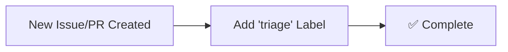
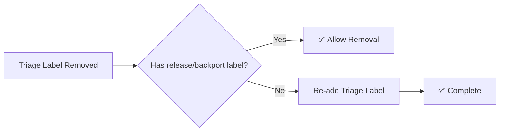
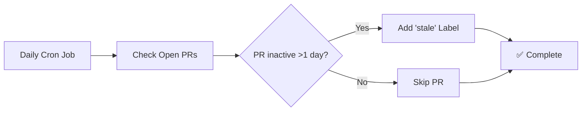
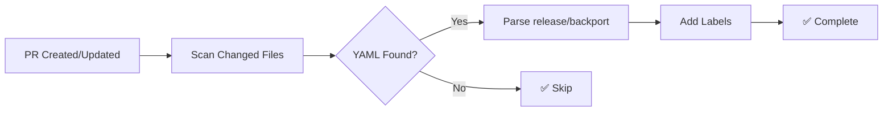

# GitHub Repository Automations

This repository contains GitHub Actions workflows to automate common development tasks for team projects.

## Table of Contents

- [Features](#features)
  - [1. Keeper: auto-add triage label](#1-keeper-auto-add-triage-label) ✅ **Implemented**
  - [2. Keeper: triage label protection](#2-triage-label-protection) ✅ **Implemented**
  - [3. Keeper: stale PR detector](#3-keeper-stale-pr-detector) ✅ **Implemented**
  - [4. Keeper: auto-label release and backport](#4-keeper-auto-label-release-and-backport) ✅ **Implemented**
- [Workflow Structure](#workflow-structure)
- [Implementation Plan](#implementation-plan)
- [Prerequisites](#prerequisites)
- [Usage](#usage)
- [Testing](#testing)

## Workflow Structure

```
.github/workflows/
├── keeper-auto-add-triage-label.yml       # Auto-adds triage label to new issues/PRs
├── keeper-triage-label-protection.yml     # Protects triage label from removal
├── keeper-stale-pr-detector.yml           # Marks inactive PRs as stale
└── keeper-auto-label-release-backport.yml # Auto-labels PRs based on YAML frontmatter
```

## How to use them

1. Copy the workflows under the `.github/workflows/` dir to your repository
2. Make sure to update the `if: github.repository == 'thenets/repo-automations'` to match your repository

## Features

### 1. Keeper: auto-add triage label
Automatically adds a "triage" label to new issues and pull requests when they are created.

**File**: `.github/workflows/keeper-auto-add-triage-label.yml`

**Trigger**: `issues.opened`, `pull_request.opened`

**Behavior**:
- Adds "triage" label to newly created issues
- Adds "triage" label to newly created pull requests
- Only adds if the label doesn't already exist




### 2. Keeper: triage label protection
Prevents removal of the "triage" label unless specific conditions are met.

**File**: `.github/workflows/keeper-triage-label-protection.yml`

**Trigger**: `issues.labeled`, `issues.unlabeled`, `pull_request.labeled`, `pull_request.unlabeled`

**Behavior**:
- Monitors when labels are added or removed
- If "triage" label is removed, checks for presence of:
  - Labels starting with "release " (e.g., "release 1.0", "release v2.3")
  - Labels starting with "backport " (e.g., "backport 1.0", "backport main")
- If neither condition is met, automatically re-adds the "triage" label



### 3. Keeper: stale PR detector
Automatically marks pull requests as stale when they have no activity for more than 1 day.

**File**: `.github/workflows/keeper-stale-pr-detector.yml`

**Trigger**: `schedule` (daily cron job)

**Behavior**:
- Runs daily to check all open pull requests
- Identifies PRs with no activity (comments, commits, or label changes) for more than 1 day
- Adds "stale" label to inactive PRs
- Skips PRs that already have the "stale" label
- Considers these activities as "activity":
  - New commits pushed to the PR branch
  - Comments added to the PR
  - Labels added or removed
  - PR reviews submitted
  - PR status changes (ready for review, draft, etc.)



### 4. Keeper: auto-label release and backport
Automatically adds release and backport labels to pull requests based on YAML code blocks in the PR description.

**File**: `.github/workflows/keeper-auto-label-release-backport.yml`

**Trigger**: `pull_request.opened`, `pull_request.synchronize`

**Behavior**:
- Scans the PR description for YAML code blocks
- Parses `release` and `backport` values from YAML
- Validates values against accepted lists (see below)
- Adds corresponding labels (e.g., `release 1.5`, `backport 1.4`)
- Ignores comments after `#` in YAML values
- Only processes the first YAML block found with valid content

**Accepted Values**:
- **Release tags**: `1.0`, `1.1`, `1.2`, `1.3`, `1.4`, `1.5`, `1.6`, `2.0`, `2.1`, `2.2`, `devel`, `main`
- **Backport tags**: `1.0`, `1.1`, `1.2`, `1.3`, `1.4`, `1.5`, `1.6`, `2.0`, `2.1`, `2.2`, `main`

*Note: Values not in these lists will be ignored and no labels will be added.*

**Supported YAML format**:

Include a YAML code block in your PR description:
```yaml
release: 1.5    # Creates "release 1.5" label
backport: 1.4   # Creates "backport 1.4" label  
```

**Example PR description**:
```
This PR adds new feature X.

```yaml
release: 1.5
backport: 1.4
```

The changes are backward compatible.
```



## Implementation Plan

1. **Create Auto-Add Workflow**
   - Trigger on issue and PR creation
   - Use GitHub API to add "triage" label
   - Handle edge cases (label already exists, permissions)

2. **Create Protection Workflow**
   - Trigger on label changes
   - Check if "triage" was removed
   - Validate presence of "release *" or "backport *" labels
   - Re-add "triage" if conditions not met

3. **Create Stale PR Detection Workflow**
   - Schedule daily execution using cron
   - Query all open PRs in the repository
   - Check last activity timestamp for each PR
   - Add "stale" label to PRs inactive for >1 day
   - Skip PRs already marked as stale

4. **Error Handling**
   - Handle API rate limits
   - Graceful failure on permission issues
   - Logging for debugging

## Prerequisites

- Repository must have "triage" and "stale" labels created
- GitHub Actions must have write permissions for issues and pull requests
- Workflows require `GITHUB_TOKEN` with appropriate scopes

## Usage

1. Copy workflow files to `.github/workflows/` directory
2. Ensure required labels exist in repository settings:
   - "triage" (for new issues/PRs)
   - "stale" (for inactive PRs)
3. Verify GitHub Actions permissions include:
   - `issues: write`
   - `pull-requests: write`

## Testing

- Create test issues and PRs to verify auto-labeling
- Test label removal scenarios with and without release/backport labels
- Test stale PR detection by creating PRs and waiting >1 day
- Verify workflows don't interfere with each other