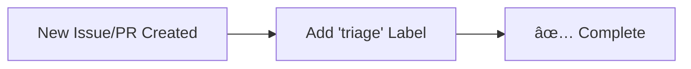
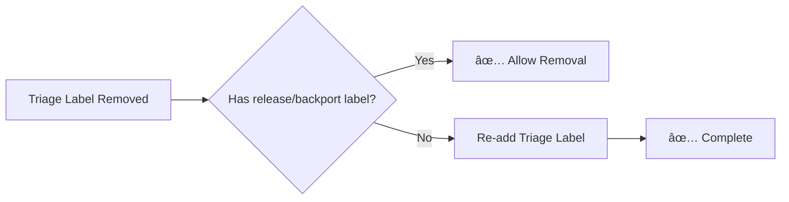
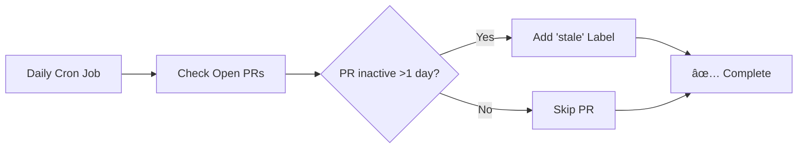
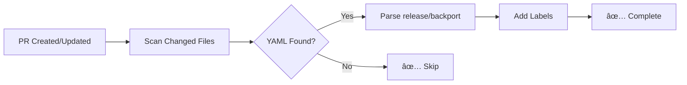
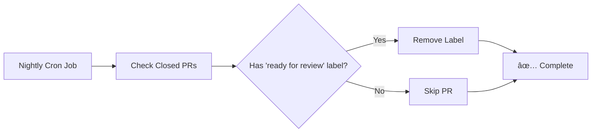

# GitHub Repository Automations

This repository contains GitHub Actions workflows to automate common development tasks for team projects.

## Table of Contents

- [Features](#features)
  - [1. Keeper: auto-add triage label](#1-keeper-auto-add-triage-label) ✅ **Implemented**
  - [2. Keeper: triage label protection](#2-triage-label-protection) ✅ **Implemented**
  - [3. Keeper: stale PR detector](#3-keeper-stale-pr-detector) ✅ **Implemented**
  - [4. Keeper: auto-label release and backport](#4-keeper-auto-label-release-and-backport) ✅ **Implemented**
  - [5. Keeper: closed PR label cleanup](#5-keeper-closed-pr-label-cleanup) 📝 **Planned**
  - [6. Keeper: feature branch auto-labeling](#6-keeper-feature-branch-auto-labeling) ✅ **Implemented**
  - [7. Keeper: ready for review labeling](#7-keeper-ready-for-review-labeling) ✅ **Implemented**
  - [8. Keeper: enhanced triage label management](#8-keeper-enhanced-triage-label-management) 📝 **Planned**
- [Workflow Structure](#workflow-structure)
- [Fork Compatibility](#fork-compatibility)
- [Prerequisites](#prerequisites)
- [Usage](#usage)
- [Testing](#testing)
- [License](#license)

## Workflow Structure

```
.github/workflows/
├── keeper-auto-add-triage-label.yml       # Auto-adds triage label to new issues/PRs
├── keeper-triage-label-protection.yml     # Protects triage label from removal
├── keeper-stale-pr-detector.yml           # Marks inactive PRs as stale
├── keeper-auto-label-release-backport.yml # Auto-labels PRs based on YAML frontmatter
├── keeper-closed-pr-label-cleanup.yml     # Removes "ready for review" label from closed PRs
├── keeper-feature-branch-auto-labeling.yml # Auto-labels PRs as "feature-branch" based on YAML frontmatter
├── keeper-enhanced-triage-management.yml  # Enhanced triage label management with release/ready conditions
└── keeper-fork-trigger.yml                # Fork-compatible data collection workflow
```

## How to use them

1. Copy the workflows under the `.github/workflows/` dir to your repository
2. Make sure to update the `if: github.repository == 'thenets/repo-automations'` to match your repository

## Features

### 1. Keeper: auto-add triage label
Automatically adds a "triage" label to new issues and pull requests when they are created.

**File**: `.github/workflows/keeper-auto-add-triage-label.yml`

**Trigger**: `issues.opened`, `pull_request.opened`

**Behavior**:
- Adds "triage" label to newly created issues
- Adds "triage" label to newly created pull requests
- Only adds if the label doesn't already exist




### 2. Keeper: triage label protection
Prevents removal of the "triage" label unless specific conditions are met.

**File**: `.github/workflows/keeper-triage-label-protection.yml`

**Trigger**: `issues.labeled`, `issues.unlabeled`, `pull_request.labeled`, `pull_request.unlabeled`

**Behavior**:
- Monitors when labels are added or removed
- If "triage" label is removed, checks for presence of:
  - Labels starting with "release " (e.g., "release 1.0", "release v2.3")
  - Labels starting with "backport " (e.g., "backport 1.0", "backport main")
- If neither condition is met, automatically re-adds the "triage" label



### 3. Keeper: stale PR detector
Automatically marks pull requests as stale when they have no activity for more than 1 day.

**File**: `.github/workflows/keeper-stale-pr-detector.yml`

**Trigger**: `schedule` (daily cron job)

**Behavior**:
- Runs daily to check all open pull requests
- Identifies PRs with no activity (comments, commits, or label changes) for more than 1 day
- Adds "stale" label to inactive PRs
- Skips PRs that already have the "stale" label
- Considers these activities as "activity":
  - New commits pushed to the PR branch
  - Comments added to the PR
  - Labels added or removed
  - PR reviews submitted
  - PR status changes (ready for review, draft, etc.)



### 4. Keeper: auto-label release and backport
Automatically adds release and backport labels to pull requests based on YAML code blocks in the PR description.

**File**: `.github/workflows/keeper-auto-label-release-backport.yml`

**Trigger**: `pull_request.opened`, `pull_request.synchronize`

**Behavior**:
- Scans the PR description for YAML code blocks
- Parses `release` and `backport` values from YAML
- Validates values against accepted lists (see below)
- Adds corresponding labels (e.g., `release 1.5`, `backport 1.4`)
- Ignores comments after `#` in YAML values
- Only processes the first YAML block found

**Validation Rules**:
- **Empty values** (e.g., `release:` with no value) → Workflow exits gracefully
- **Existing labels** → Skips assignment to preserve manually set labels
- **Valid values** (from accepted lists) → Labels are added successfully  
- **Invalid values** (not in accepted lists) → **Workflow fails with error**
- **Quotes** → Both single and double quotes are supported and automatically removed
- **Case sensitivity** → Values are case-sensitive for release/backport (e.g., `devel` not `Devel`)

**Accepted Values**:
- **Release tags**: `1.0`, `1.1`, `1.2`, `1.3`, `1.4`, `1.5`, `1.6`, `2.0`, `2.1`, `2.2`, `devel`, `main`
- **Backport tags**: `1.0`, `1.1`, `1.2`, `1.3`, `1.4`, `1.5`, `1.6`, `2.0`, `2.1`, `2.2`, `main`

*Note: Using values not in these lists will cause the workflow to fail, alerting you to fix the invalid value.*

**Supported YAML format**:

Include a YAML code block in your PR description:
```yaml
release: 1.5        # Creates "release 1.5" label
backport: 1.4       # Creates "backport 1.4" label
release: "devel"    # Quotes are supported (single or double)
backport: 'main'    # Both single and double quotes work
```

**Example PR description**:

> This PR adds new feature X.
> 
> ```yaml
> release: "1.5"      # Quotes are optional
> backport: 1.4       # Works with or without quotes
> ```
> 
> The changes are backward compatible.



### 5. Keeper: closed PR label cleanup
Automatically removes the "ready for review" label from closed pull requests during nightly runs.

**File**: `.github/workflows/keeper-closed-pr-label-cleanup.yml`

**Trigger**: `schedule` (nightly cron job)

**Behavior**:
- Runs nightly to check all closed pull requests
- Identifies closed PRs that still have the "ready for review" label
- Removes the "ready for review" label from these PRs
- Helps maintain clean label states by removing review-related labels that are no longer relevant
- Only processes PRs that are in closed state (merged or closed without merge)



### 6. Keeper: feature branch auto-labeling
Automatically adds "feature-branch" label to pull requests based on YAML code blocks in the PR description.

**File**: `.github/workflows/keeper-feature-branch-auto-labeling.yml`

**Trigger**: `pull_request.opened`, `pull_request.synchronize`

**Behavior**:
- Scans the PR description for YAML code blocks
- Parses `needs_feature_branch` value from YAML (Boolean: `true` or `false`)
- If `needs_feature_branch: true`, adds "feature-branch" label to the PR
- If `needs_feature_branch: false`, no action is taken
- Ignores comments after `#` in YAML values
- Only processes the first YAML block found

**Validation Rules**:
- **Empty values** (e.g., `needs_feature_branch:` with no value) → Workflow exits gracefully
- **Existing labels** → Skips assignment to preserve manually set labels
- **Valid values** (`true`, `false`) → Labels are added successfully if `true`
- **Invalid values** (not boolean) → **Workflow fails with error**
- **Quotes** → Both single and double quotes are supported and automatically removed
- **Case insensitive** → Accepts `true`, `True`, `TRUE`, `false`, `False`, `FALSE`, etc.

**Supported YAML format**:

Include a YAML code block in your PR description:
```yaml
needs_feature_branch: true    # Creates "feature-branch" label
needs_feature_branch: True    # Case-insensitive: True, FALSE, etc.
needs_feature_branch: "false" # Quotes are supported (single or double)
release: 1.5                  # Creates "release 1.5" label (existing feature)
backport: 1.4                 # Creates "backport 1.4" label (existing feature)
```

**Example PR description**:

> This PR adds new feature X that requires a feature branch.
> 
> ```yaml
> needs_feature_branch: True    # Case-insensitive
> release: "1.5"                # Quotes are optional
> backport: 1.4
> ```
> 
> The changes require coordination with multiple teams.

```mermaid
flowchart LR
    A[PR Created/Updated] --> B[Scan PR Description]
    B --> C{YAML Found?}
    C -->|Yes| D[Parse needs_feature_branch]
    C -->|No| E[✅ Skip]
    D --> F{Value is true?}
    F -->|Yes| G[Add feature-branch Label]
    F -->|No| H[✅ Skip]
    G --> I[✅ Complete]
    H --> I
```



### 7. Keeper: ready for review labeling
Automatically adds "ready for review" label to pull requests that have a release label but no triage label.

**File**: `.github/workflows/keeper-ready-for-review-labeling.yml`

**Trigger**: `workflow_run` (triggered by `keeper-fork-trigger.yml`)

**Behavior**:
- Monitors pull request events from the fork trigger workflow
- Checks if PR has any label starting with "release " (e.g., "release 1.5", "release main")
- Verifies that PR does NOT have the "triage" label
- If both conditions are met, adds "ready for review" label to the PR
- Skips if "ready for review" label already exists
- This indicates the PR is properly categorized and ready for team review

**Logic Flow**:
1. **PR Event Detected** → Check if PR has "release *" label
2. **Has Release Label** → Check if PR lacks "triage" label  
3. **No Triage Label** → Add "ready for review" label
4. **Conditions Not Met** → No action taken

**Integration with Existing Workflows**:
- **Works with** `keeper-auto-label-release-backport.yml` for release label assignment
- **Complements** `keeper-triage-label-protection.yml` for complete label lifecycle
- **Integrates with** `keeper-closed-pr-label-cleanup.yml` for cleanup when PR is closed

```mermaid
flowchart LR
    A[PR Event] --> B{Has release label?}
    B -->|Yes| C{Has triage label?}
    B -->|No| D[✅ No Action]
    C -->|No| E[Add ready for review Label]
    C -->|Yes| F[✅ No Action - Still in Triage]
    E --> G[✅ Complete]
```



### 8. Keeper: enhanced triage label management
Enhances the existing triage label protection by automatically removing the "triage" label when specific conditions are met.

**File**: `.github/workflows/keeper-enhanced-triage-management.yml`

**Trigger**: `pull_request.labeled`, `pull_request.unlabeled`

**Behavior**:
- Monitors when labels are added or removed from PRs
- Automatically removes "triage" label when ALL conditions are met:
  - PR has any label starting with "release " (e.g., "release 1.5", "release main")
  - PR has "ready for review" label
- This indicates the PR is properly categorized and ready for review, so triage is no longer needed
- Works in conjunction with existing triage protection workflow

**Logic Flow**:
1. **Label Change Detected** → Check if PR has both "release *" and "ready for review" labels
2. **Conditions Met** → Remove "triage" label (if present)
3. **Conditions Not Met** → No action taken (existing protection workflow handles re-adding if needed)

**Integration with Existing Workflows**:
- **Complements** `keeper-triage-label-protection.yml` (doesn't replace it)
- **Works with** `keeper-auto-label-release-backport.yml` for complete label management
- **Respects** manual label changes by only acting on specific conditions

```mermaid
flowchart LR
    A[PR Label Change] --> B{Has release label?}
    B -->|Yes| C{Has ready for review?}
    B -->|No| D[✅ No Action]
    C -->|Yes| E[Remove triage Label]
    C -->|No| F[✅ No Action]
    E --> G[✅ Complete]
```



## Fork Compatibility

This repository implements a **fork-compatible architecture** that allows external contributors to trigger labeling workflows seamlessly. The system uses a two-workflow pattern to separate data collection from privileged operations.

### Problem Statement

Traditional GitHub Actions workflows fail when triggered by pull requests from forks because:
- Forked repositories don't have access to the original repository's secrets
- GitHub's default `GITHUB_TOKEN` has limited permissions for external contributors
- Workflows cannot add labels to pull requests from forks without elevated permissions

### Solution Architecture

We implement a **two-workflow pattern** that separates data collection from privileged operations:

1. **Data Collection Workflow** (`keeper-fork-trigger`): Runs on any repository (including forks), collects ALL PR metadata as-is
2. **Action Workflows** (`keeper-*`): Triggered by data collection completion, run only on target repository with full permissions

### Workflow Communication Pattern

```mermaid
flowchart TD
    A[PR Created/Updated on Fork] --> FT
    
    subgraph FT ["🔄 keeper-fork-trigger.yml (Runs on Fork)"]
        direction TB
        B[Collect PR Metadata]
        C[Extract: title, body, draft, etc.]
        D[Store as pr-metadata.json]
        E[Upload Artifact]
        B --> C --> D --> E
    end
    
    FT --> TG[Trigger Action Workflows]
    
    subgraph AW ["🎯 Action Workflows (Run on Target Repo)"]
        direction TB
        subgraph FB ["keeper-feature-branch-auto-labeling.yml"]
            F1[Download Artifact] --> F2[Parse YAML from prData.body] --> F3[Apply feature-branch Label]
        end
        
        subgraph RB ["keeper-auto-label-release-backport.yml"]
            R1[Download Artifact] --> R2[Parse YAML from prData.body] --> R3[Apply release/backport Labels]
        end
        
        subgraph TR ["keeper-auto-add-triage-label.yml"]
            T1[Download Artifact] --> T2[Check prData.draft] --> T3[Apply triage Label]
        end
        
        subgraph RDY ["keeper-ready-for-review-labeling.yml"]
            R1[Download Artifact] --> R2[Check release & triage labels] --> R3[Apply ready for review Label]
        end
    end
    
    TG --> FB
    TG --> RB  
    TG --> TR
    TG --> RDY
    
    FB --> Z[✅ Complete]
    RB --> Z
    TR --> Z
    RDY --> Z
    
    style A fill:#e1f5fe
    style FT fill:#fff3e0
    style AW fill:#f3e5f5
    style Z fill:#e8f5e8
```



### Fork Compatibility Status

| Workflow | Fork Compatible | Status | Notes |
|----------|-----------------|--------|--------|
| **keeper-fork-trigger.yml** | ✅ N/A | ✅ Working | Data collection workflow |
| **keeper-auto-add-triage-label.yml** | ✅ Yes | ✅ Complete | Full artifact consumption |
| **keeper-auto-label-release-backport.yml** | ✅ Yes | ✅ Complete | Full artifact consumption |
| **keeper-feature-branch-auto-labeling.yml** | ✅ Yes | ✅ Complete | Full artifact consumption |
| **keeper-ready-for-review-labeling.yml** | ✅ Yes | ✅ Complete | Full artifact consumption |
| **keeper-triage-label-protection.yml** | ✅ N/A | ✅ No changes needed | Uses labeled/unlabeled |
| **keeper-stale-pr-detector.yml** | ✅ N/A | ✅ No changes needed | Uses schedule/dispatch |

### Benefits

1. **External Contributor Friendly**: PRs from forks trigger workflows seamlessly
2. **Security**: Privileged operations only run on target repository  
3. **Minimal Changes**: Existing logic preserved, just data source changed
4. **Performance**: Complete workflow chain executes in ~1-2 minutes
5. **Backward Compatible**: All existing functionality preserved

## Fine-Grained Token Permissions

### For External Contributors

When external contributors (non-collaborators) create pull requests or issues, the default `GITHUB_TOKEN` has limited permissions and may cause workflows to fail with permission errors. To enable all workflows to function properly for external contributors, repository administrators should create a fine-grained personal access token.

### Required Permissions

**Repository Access:**
- This repository (or "All repositories" for organization-wide use)

**Repository Permissions:**
- **Issues: Write** - Required to add labels to issues
- **Issues: Read** - Required to access issue comments and timeline events
- **Pull requests: Write** - Required to add labels to pull requests
- **Pull requests: Read** - Required to list and read pull request details
- **Metadata: Read** - Required to access repository information

### Setup Instructions

1. **Create Token**: Go to [GitHub Settings > Personal Access Tokens (Beta)](https://github.com/settings/tokens?type=beta)
2. **Configure Access**: Select the target repository or choose "All repositories" for organization-wide use
3. **Set Permissions**: Grant all the permissions listed above
4. **Add to Repository**: Add the token as a repository secret named `CUSTOM_GITHUB_TOKEN`
   - Go to your repository Settings > Secrets and variables > Actions
   - Click "New repository secret"
   - Name: `CUSTOM_GITHUB_TOKEN`
   - Value: Your generated token

### Workflow Behavior

- **With Custom Token**: All workflows will function properly for external contributors
- **Without Custom Token**: Workflows may fail for external contributors with clear error messages explaining the setup required
- **Backward Compatible**: Existing setups continue to work without any changes required

## Prerequisites

- Repository must have "triage" and "stale" labels created
- GitHub Actions must have write permissions for issues and pull requests
- Workflows require `GITHUB_TOKEN` with appropriate scopes

## Usage

1. Copy workflow files to `.github/workflows/` directory
2. Ensure required labels exist in repository settings:
   - "triage" (for new issues/PRs)
   - "stale" (for inactive PRs)
3. Verify GitHub Actions permissions include:
   - `issues: write`
   - `pull-requests: write`

## Testing

### Prerequisites for Testing

1. **Fork this repository** to your GitHub account
2. **Update repository references** in all workflow files:
   - Change `if: github.repository == 'thenets/repo-automations'` to `if: github.repository == 'your-username/repo-automations'`
   - This line appears in all `keeper-*.yml` workflow files under `.github/workflows/`

### Automated Testing

Run the test suite:

```bash
# Run all tests
make test

# Run specific test method
make venv
./venv/bin/pytest -k test_stale_pr_detection_manual_trigger -v
```

## License

This project is licensed under the MIT License. See the [LICENSE](./LICENSE) file for details.