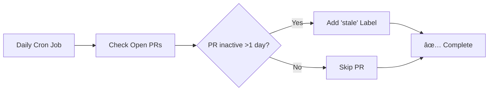
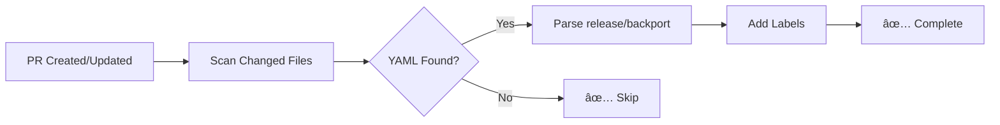
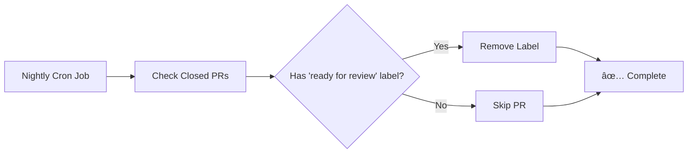

# GitHub Repository Automations

**Complete Repository Automation** is now available as a unified GitHub Action! This project has migrated from individual keeper workflows to a single, powerful action that reduces configuration from ~1,500 lines to just ~20 lines.

## 🚀 GitHub Action (Action Mode Only)

This repository now **only supports the Action mode**. All individual keeper workflows have been removed and consolidated into a single, feature-rich GitHub Action.

### Quick Start

**Basic Triage Only:**
```yaml
name: Repository Triage Automation
on:
  issues:
    types: [opened]
  pull_request:
    types: [opened, ready_for_review]

permissions:
  issues: write
  pull-requests: write

jobs:
  triage:
    runs-on: ubuntu-latest
    steps:
      - uses: thenets/repo-automation@v1
        with:
          github-token: ${{ secrets.GITHUB_TOKEN }}
```

**Complete Automation (All Features):**
```yaml
name: Complete Repository Automation
on:
  issues:
    types: [opened, labeled, unlabeled]
  pull_request:
    types: [opened, synchronize, edited, ready_for_review, labeled, unlabeled]
  workflow_run:
    workflows: ["Keeper: trigger"]
    types: [completed]
  schedule:
    - cron: '0 2 * * *'

permissions:
  issues: write
  pull-requests: write
  checks: write

jobs:
  automation:
    runs-on: ubuntu-latest
    if: github.repository == 'your-org/your-repo'
    steps:
      - uses: thenets/repo-automation@v1
        with:
          github-token: ${{ secrets.GITHUB_TOKEN }}
          custom-github-token: ${{ secrets.CUSTOM_GITHUB_TOKEN }}
          accepted-releases: '["1.0", "2.0", "devel"]'
          accepted-backports: '["1.0", "2.0"]'
          enable-feature-branch: true
          stale-days: 1
```

### Features Auto-Enabled by Inputs

- **Core Triage**: Always enabled (adds triage labels, smart labeling, label protection)
- **Release/Backport Labeling**: Enabled when `accepted-releases` or `accepted-backports` provided
- **Feature Branch Automation**: Enabled when `enable-feature-branch: true`
- **Stale Detection**: Enabled when `stale-days` provided or `schedule` event

**Benefits:**
- ✅ **98%+ Code Reduction**: From ~1,500 lines to ~20 lines
- ✅ **Feature-Based Design**: No automation types - features activate based on inputs
- ✅ **No hardcoded repository references** - works with any repository
- ✅ **Automatic updates** when you pin to a version
- ✅ **Fork compatible** with workflow_run pattern preserved
- ✅ **Comprehensive error handling** with check runs and comments
- ✅ **Dry-run mode** for safe testing

📚 **See [examples/comprehensive-usage.yml](examples/comprehensive-usage.yml) for comprehensive configuration examples and migration guides.**

### Migration Status

| Feature | Original Workflow | GitHub Action | Repository Status |
|---------|------------------|---------------|--------------------|
| **Triage Management** | `keeper-triage.yml` (339 lines) | ✅ Integrated | **🗑️ REMOVED** |
| **Stale Detection** | `keeper-stale-pr-detector.yml` (235 lines) | ✅ Integrated | **🗑️ REMOVED** |
| **Release/Backport Labeling** | `keeper-auto-label-release-backport.yml` (442 lines) | ✅ Integrated | **🗑️ REMOVED** |
| **Feature Branch Labeling** | `keeper-feature-branch-auto-labeling.yml` (456 lines) | ✅ Integrated | **🗑️ REMOVED** |
| **Fork Compatibility** | `keeper-trigger.yml` (163 lines) | ✅ Preserved | **✅ ACTIVE** |
| **Unified Automation** | **NEW**: `repository-automation.yml` (79 lines) | ✅ Active | **✅ DEPLOYED** |

**Migration Result**: ✅ **COMPLETE** - All legacy workflows removed and replaced with unified GitHub Action!  
**Code Reduction**: 1,635 lines → 79 lines (**95% reduction**) + reusable action benefits

---

## Table of Contents

- [🚀 GitHub Action (Action Mode Only)](#-github-action-action-mode-only) ⭐ **Current Mode**
- [📚 Comprehensive Examples](#-see-examplescomprehensive-usageyml-for-comprehensive-configuration-examples-and-migration-guides) 📖 **Configuration Guide**
- [🎉 Migration Complete](#-migration-complete---this-repository-as-reference) ✅ **Success Story**
- [📋 Legacy Documentation](#legacy-documentation-historical-reference) 📚 **Historical Reference**
- [🔧 Prerequisites](#prerequisites)
- [🚀 Usage](#usage)
- [🧪 Testing](#testing)
- [⚙️ Development](#development)
- [📄 License](#license)

## 🎉 Current Workflow Structure (Post-Migration)

```
.github/workflows/
├── repository-automation.yml           # 🆕 Unified automation using the GitHub Action (79 lines)
├── keeper-trigger.yml                  # Fork compatibility (preserved)
└── test-triage-action.yml             # Enhanced testing workflow
```

**Previously (REMOVED):**
- ~~`keeper-triage.yml`~~ (339 lines) → Integrated into action
- ~~`keeper-stale-pr-detector.yml`~~ (235 lines) → Integrated into action  
- ~~`keeper-auto-label-release-backport.yml`~~ (442 lines) → Integrated into action
- ~~`keeper-feature-branch-auto-labeling.yml`~~ (456 lines) → Integrated into action

## 🎉 Migration Complete - This Repository as Reference

> **✅ Migration Complete**: This repository has successfully migrated from individual keeper workflows to the unified GitHub Action! The legacy workflows have been **removed** and replaced with `repository-automation.yml`.

### Repository Migration Example

This repository serves as a **real-world migration example**:

- **Before**: 4 individual keeper workflows (1,635 lines)
- **After**: 1 unified workflow using the action (79 lines)  
- **Result**: 95% code reduction + simplified maintenance

**Active Workflows in This Repository:**
- `repository-automation.yml` - Complete automation using the action
- `keeper-trigger.yml` - Fork compatibility (preserved)  
- `test-triage-action.yml` - Testing workflow (enhanced)

### Migration Guide for Your Repository

To migrate your repository from individual workflows:

1. **Replace** all `keeper-*.yml` files with a single `repository-automation.yml` using the action
2. **Keep** `keeper-trigger.yml` for fork compatibility (if needed)
3. **Configure** features using action inputs instead of separate files
4. **Test** using dry-run mode first

### Legacy Documentation (Historical Reference)

> ⚠️ **Note**: The sections below document the original individual workflows for historical reference only. **These workflows have been removed from this repository** and replaced with the unified GitHub Action. 
> 
> For current usage, see the [GitHub Action examples](#-github-action-action-mode-only) and [comprehensive configuration guide](examples/comprehensive-usage.yml).

## Features

### 1. Keeper: unified triage management
Unified workflow that handles triage labeling, label protection, and ready-for-review labeling in a single, intelligent system.

**File**: `.github/workflows/keeper-triage.yml`

**Trigger**: `issues.opened`, `workflow_run` (from `keeper-trigger.yml`)

**Behavior**:

**For Issues:**
- Automatically adds "triage" label to newly created issues
- Protects "triage" label from removal (re-adds if removed without release/backport labels)

**For Pull Requests:**
1. **Waits 10 seconds** for other workflows to complete
2. **Smart Conditional Labeling**:
   - If PR has "release *" label AND is not in draft mode → Adds "ready for review" label
   - Otherwise → Adds "triage" label
3. **Label Protection**: Prevents "triage" label removal unless release/backport labels are present
4. **Draft Handling**: Skips labeling for draft PRs entirely

**Integration Benefits**:
- **Unified Logic**: All triage-related labeling in one workflow
- **Intelligent Decision Making**: Context-aware labeling based on PR state
- **Reduced Overhead**: Single workflow instead of three separate ones
- **Fork Compatible**: Works seamlessly with external contributor PRs


### 2. Keeper: stale PR detector
Automatically marks pull requests as stale when they have no activity for more than 1 day.

**File**: `.github/workflows/keeper-stale-pr-detector.yml`

**Trigger**: `schedule` (daily cron job)

**Behavior**:
- Runs daily to check all open pull requests
- Identifies PRs with no activity (comments, commits, or label changes) for more than 1 day
- Adds "stale" label to inactive PRs
- Skips PRs that already have the "stale" label
- Considers these activities as "activity":
  - New commits pushed to the PR branch
  - Comments added to the PR
  - Labels added or removed
  - PR reviews submitted
  - PR status changes (ready for review, draft, etc.)



### 3. Keeper: auto-label release and backport
Automatically adds release and backport labels to pull requests based on YAML code blocks in the PR description.

**File**: `.github/workflows/keeper-auto-label-release-backport.yml`

**Trigger**: `pull_request.opened`, `pull_request.synchronize`

**Behavior**:
- Scans the PR description for YAML code blocks
- Parses `release` and `backport` values from YAML
- Validates values against accepted lists (see below)
- Adds corresponding labels (e.g., `release 1.5`, `backport 1.4`)
- Ignores comments after `#` in YAML values
- Only processes the first YAML block found

**Validation Rules**:
- **Empty values** (e.g., `release:` with no value) → Workflow exits gracefully
- **Existing labels** → Skips assignment to preserve manually set labels
- **Valid values** (from accepted lists) → Labels are added successfully  
- **Invalid values** (not in accepted lists) → **Workflow fails with error**
- **Quotes** → Both single and double quotes are supported and automatically removed
- **Case sensitivity** → Values are case-sensitive for release/backport (e.g., `devel` not `Devel`)

**Accepted Values**:
- **Release tags**: `1.0`, `1.1`, `1.2`, `1.3`, `1.4`, `1.5`, `1.6`, `2.0`, `2.1`, `2.2`, `devel`, `main`
- **Backport tags**: `1.0`, `1.1`, `1.2`, `1.3`, `1.4`, `1.5`, `1.6`, `2.0`, `2.1`, `2.2`, `main`

*Note: Using values not in these lists will cause the workflow to fail, alerting you to fix the invalid value.*

**Supported YAML format**:

Include a YAML code block in your PR description:
```yaml
release: 1.5        # Creates "release 1.5" label
backport: 1.4       # Creates "backport 1.4" label
release: "devel"    # Quotes are supported (single or double)
backport: 'main'    # Both single and double quotes work
```

**Example PR description**:

> This PR adds new feature X.
> 
> ```yaml
> release: "1.5"      # Quotes are optional
> backport: 1.4       # Works with or without quotes
> ```
> 
> The changes are backward compatible.



### 4. Keeper: closed PR label cleanup
Automatically removes the "ready for review" label from closed pull requests during nightly runs.

**File**: `.github/workflows/keeper-closed-pr-label-cleanup.yml`

**Trigger**: `schedule` (nightly cron job)

**Behavior**:
- Runs nightly to check all closed pull requests
- Identifies closed PRs that still have the "ready for review" label
- Removes the "ready for review" label from these PRs
- Helps maintain clean label states by removing review-related labels that are no longer relevant
- Only processes PRs that are in closed state (merged or closed without merge)



### 5. Keeper: feature branch auto-labeling
Automatically adds "feature-branch" label to pull requests based on YAML code blocks in the PR description.

**File**: `.github/workflows/keeper-feature-branch-auto-labeling.yml`

**Trigger**: `pull_request.opened`, `pull_request.synchronize`

**Behavior**:
- Scans the PR description for YAML code blocks
- Parses `needs_feature_branch` value from YAML (Boolean: `true` or `false`)
- If `needs_feature_branch: true`, adds "feature-branch" label to the PR
- If `needs_feature_branch: false`, no action is taken
- Ignores comments after `#` in YAML values
- Only processes the first YAML block found

**Validation Rules**:
- **Empty values** (e.g., `needs_feature_branch:` with no value) → Workflow exits gracefully
- **Existing labels** → Skips assignment to preserve manually set labels
- **Valid values** (`true`, `false`) → Labels are added successfully if `true`
- **Invalid values** (not boolean) → **Workflow fails with error**
- **Quotes** → Both single and double quotes are supported and automatically removed
- **Case insensitive** → Accepts `true`, `True`, `TRUE`, `false`, `False`, `FALSE`, etc.

**Supported YAML format**:

Include a YAML code block in your PR description:
```yaml
needs_feature_branch: true    # Creates "feature-branch" label
needs_feature_branch: True    # Case-insensitive: True, FALSE, etc.
needs_feature_branch: "false" # Quotes are supported (single or double)
release: 1.5                  # Creates "release 1.5" label (existing feature)
backport: 1.4                 # Creates "backport 1.4" label (existing feature)
```

**Example PR description**:

> This PR adds new feature X that requires a feature branch.
> 
> ```yaml
> needs_feature_branch: True    # Case-insensitive
> release: "1.5"                # Quotes are optional
> backport: 1.4
> ```
> 
> The changes require coordination with multiple teams.

```mermaid
flowchart LR
    A[PR Created/Updated] --> B[Scan PR Description]
    B --> C{YAML Found?}
    C -->|Yes| D[Parse needs_feature_branch]
    C -->|No| E[✅ Skip]
    D --> F{Value is true?}
    F -->|Yes| G[Add feature-branch Label]
    F -->|No| H[✅ Skip]
    G --> I[✅ Complete]
    H --> I
```



### 6. Keeper: enhanced triage label management
Enhances the existing triage label protection by automatically removing the "triage" label when specific conditions are met.

**File**: `.github/workflows/keeper-enhanced-triage-management.yml`

**Trigger**: `pull_request.labeled`, `pull_request.unlabeled`

**Behavior**:
- Monitors when labels are added or removed from PRs
- Automatically removes "triage" label when ALL conditions are met:
  - PR has any label starting with "release " (e.g., "release 1.5", "release main")
  - PR has "ready for review" label
- This indicates the PR is properly categorized and ready for review, so triage is no longer needed
- Works in conjunction with existing triage protection workflow

**Logic Flow**:
1. **Label Change Detected** → Check if PR has both "release *" and "ready for review" labels
2. **Conditions Met** → Remove "triage" label (if present)
3. **Conditions Not Met** → No action taken (existing protection workflow handles re-adding if needed)

**Integration with Existing Workflows**:
- **Works with** `keeper-triage.yml` for complete triage label lifecycle management
- **Works with** `keeper-auto-label-release-backport.yml` for complete label management
- **Respects** manual label changes by only acting on specific conditions

```mermaid
flowchart LR
    A[PR Label Change] --> B{Has release label?}
    B -->|Yes| C{Has ready for review?}
    B -->|No| D[✅ No Action]
    C -->|Yes| E[Remove triage Label]
    C -->|No| F[✅ No Action]
    E --> G[✅ Complete]
```



## Fork Compatibility

This repository implements a **fork-compatible architecture** that allows external contributors to trigger labeling workflows seamlessly. The system uses a two-workflow pattern to separate data collection from privileged operations.

### Problem Statement

Traditional GitHub Actions workflows fail when triggered by pull requests from forks because:
- Forked repositories don't have access to the original repository's secrets
- GitHub's default `GITHUB_TOKEN` has limited permissions for external contributors
- Workflows cannot add labels to pull requests from forks without elevated permissions

### Solution Architecture

We implement a **two-workflow pattern** that separates data collection from privileged operations:

1. **Data Collection Workflow** (`keeper-trigger`): Runs on any repository (including forks), collects ALL PR metadata as-is
2. **Action Workflows** (`keeper-*`): Triggered by data collection completion, run only on target repository with full permissions

### Workflow Communication Pattern


### Fork Compatibility Status

| Workflow | Fork Compatible | Status | Notes |
|----------|-----------------|--------|--------|
| **keeper-trigger.yml** | ✅ N/A | ✅ Working | Central data collection workflow |
| **keeper-triage.yml** | ✅ Yes | ✅ Complete | Unified triage management with full artifact consumption |
| **keeper-auto-label-release-backport.yml** | ✅ Yes | ✅ Complete | Full artifact consumption |
| **keeper-feature-branch-auto-labeling.yml** | ✅ Yes | ✅ Complete | Full artifact consumption |
| **keeper-stale-pr-detector.yml** | ✅ N/A | ✅ No changes needed | Uses schedule/dispatch |

### Benefits

1. **External Contributor Friendly**: PRs from forks trigger workflows seamlessly
2. **Security**: Privileged operations only run on target repository  
3. **Minimal Changes**: Existing logic preserved, just data source changed
4. **Performance**: Complete workflow chain executes in ~1-2 minutes
5. **Backward Compatible**: All existing functionality preserved

## Fine-Grained Token Permissions

### For External Contributors

When external contributors (non-collaborators) create pull requests or issues, the default `GITHUB_TOKEN` has limited permissions and may cause workflows to fail with permission errors. To enable all workflows to function properly for external contributors, repository administrators should create a fine-grained personal access token.

### Required Permissions

**Repository Access:**
- This repository (or "All repositories" for organization-wide use)

**Repository Permissions:**
- **Issues: Write** - Required to add labels to issues
- **Issues: Read** - Required to access issue comments and timeline events
- **Pull requests: Write** - Required to add labels to pull requests
- **Pull requests: Read** - Required to list and read pull request details
- **Metadata: Read** - Required to access repository information

### Setup Instructions

1. **Create Token**: Go to [GitHub Settings > Personal Access Tokens (Beta)](https://github.com/settings/tokens?type=beta)
2. **Configure Access**: Select the target repository or choose "All repositories" for organization-wide use
3. **Set Permissions**: Grant all the permissions listed above
4. **Add to Repository**: Add the token as a repository secret named `CUSTOM_GITHUB_TOKEN`
   - Go to your repository Settings > Secrets and variables > Actions
   - Click "New repository secret"
   - Name: `CUSTOM_GITHUB_TOKEN`
   - Value: Your generated token

### Workflow Behavior

- **With Custom Token**: All workflows will function properly for external contributors
- **Without Custom Token**: Workflows may fail for external contributors with clear error messages explaining the setup required
- **Backward Compatible**: Existing setups continue to work without any changes required

## Prerequisites

- Repository must have "triage", "stale", and "ready for review" labels created
- GitHub Actions must have write permissions for issues and pull requests
- Workflows require `GITHUB_TOKEN` with appropriate scopes

## Usage

1. Copy workflow files to `.github/workflows/` directory
2. Ensure required labels exist in repository settings:
   - "triage" (for new issues/PRs)
   - "stale" (for inactive PRs)
   - "ready for review" (for PRs ready for team review)
3. Verify GitHub Actions permissions include:
   - `issues: write`
   - `pull-requests: write`

## Testing

### Prerequisites for Testing

1. **Fork this repository** to your GitHub account
2. **Update repository references** in all workflow files:
   - Change `if: github.repository == 'thenets/repo-automations'` to `if: github.repository == 'your-username/repo-automations'`
   - This line appears in all `keeper-*.yml` workflow files under `.github/workflows/`

### Test File Structure

The test suite is organized with shared fixtures and utilities in a centralized structure:

```
test/
├── conftest.py                      # Shared fixtures and utilities for all tests
├── test_triage_auto_add.py         # Triage label management and stale PR detection tests
├── test_feature_branch_labeler.py  # Feature branch labeling tests (basic + error reporting)
├── test_release_backport_labeler.py # Release/backport labeling tests (basic + error reporting)
├── test_ready_for_review_labeling.py # Ready-for-review label workflow tests
├── test_yaml_variations.py         # YAML parsing edge cases and format variations
├── test_label_validation.py        # Label validation and error handling tests
└── test_basic_functionality.py     # Basic smoke tests
```

**Key Components:**
- **`conftest.py`**: Contains `GitHubTestManager` and `GitHubFixtures` classes with all shared test utilities (Git operations, PR/issue management, label operations, polling utilities)
- **Integration Tests**: All test classes inherit from `GitHubFixtures` and use real GitHub API calls
- **Error Reporting Tests**: Dedicated test classes for validation error comment lifecycle (creation, auto-cleanup)
- **Parallel Execution**: Tests use thread-safe unique naming for parallel test execution

### Automated Testing

Run the test suite:

```bash
# Run all tests (Warning: Takes 1+ minutes)
make test

# Run specific test file
./venv/bin/pytest test/test_feature_branch_labeler.py -v

# Run specific test method
./venv/bin/pytest -k test_stale_pr_detection_manual_trigger -v

# Run specific test class
./venv/bin/pytest test/test_feature_branch_labeler.py::TestFeatureBranchErrorReporting -v
```

## Development

### Creating a New GitHub Action Workflow

When adding a new automation workflow, follow these guidelines:

#### 1. **Workflow Architecture**
All new workflows should follow the **fork-compatible two-workflow pattern**:

- **Data Collection**: Use `keeper-trigger.yml` to collect PR/issue metadata
- **Action Workflow**: Create your new workflow triggered by `workflow_run` from `keeper-trigger`

#### 2. **Design Pattern**
Use `keeper-auto-label-release-backport.yml` as your reference template:

```yaml
name: "Your New Workflow"
on:
  workflow_run:
    workflows: ["Repository Automation: Trigger"]
    types: [completed]

jobs:
  your-job:
    if: >
      github.event.workflow_run.conclusion == 'success' &&
      github.repository == 'thenets/repo-automations'
    runs-on: ubuntu-latest
    permissions:
      issues: write
      pull-requests: write
    
    steps:
      - name: Download artifact
        uses: actions/download-artifact@v4
        with:
          github-token: ${{ secrets.GITHUB_TOKEN }}
          run-id: ${{ github.event.workflow_run.id }}
          name: pr-metadata
      
      # Your workflow logic here
```

#### 3. **Implementation Checklist**
- [ ] **Trigger**: Use `workflow_run` from `keeper-trigger.yml`
- [ ] **Repository Check**: Include `if: github.repository == 'your-org/your-repo'` condition
- [ ] **Permissions**: Add required `issues: write` and `pull-requests: write` permissions
- [ ] **Artifact Download**: Download `pr-metadata` artifact for PR/issue data
- [ ] **Error Handling**: Implement error reporting with comments and check runs (see release/backport workflow)
- [ ] **Fork Compatibility**: Test with external contributor PRs
- [ ] **File Naming**: Use `keeper-{feature-name}.yml` convention

#### 4. **Error Reporting Pattern**
For workflows that validate YAML or user input, implement error reporting:

```yaml
- name: Post validation error comment
  if: failure()
  uses: actions/github-script@v7
  with:
    script: |
      const comment = `🚨 YAML Validation Error: your feature
      
      **Invalid value found**: "${invalidValue}"
      
      **How to fix:**
      1. Update your PR description
      2. Use valid values from the accepted list
      
      Valid YAML format:
      \`\`\`yaml
      your_field: valid_value
      \`\`\``;
      
      // Post comment and create check run
```

### Creating a New Test

When adding tests for new workflows or features, follow these guidelines:

#### 1. **Check Existing Fixtures**
Before writing new test utilities, review `test/conftest.py`:

```python
# Available fixtures and utilities:
class GitHubTestManager:
    # Git operations: create_branch(), git_commit_and_push(), push_branch()
    # PR/Issue management: create_pr(), create_issue(), close_pr()
    # Label operations: create_label(), get_pr_labels(), pr_has_label()
    # Comment operations: get_pr_comments(), pr_has_comment_containing()
    # Polling utilities: poll_until_condition()

class GitHubFixtures:
    # test_repo: Temporary repository with basic labels
    # integration_manager: GitHubTestManager instance
    # github_manager: Function-scoped GitHubTestManager
```

#### 2. **Use Reference Pattern**
Follow `test_release_backport_labeler.py` as your template:

```python
"""
Test suite for your new workflow.

This test validates that the workflow does X, Y, and Z.
"""

import pytest
from .conftest import GitHubTestManager, GitHubFixtures

@pytest.mark.integration
class TestYourWorkflow(GitHubFixtures):
    """Integration test cases for your workflow."""

    def test_basic_functionality(self, test_repo, integration_manager):
        """Test basic workflow functionality.
        
        Steps:
        1. Create a new branch
        2. Create file changes and commit
        3. Create PR with test configuration
        4. Wait for workflow to process
        5. Verify expected behavior
        6. Cleanup PR
        """
        repo_path = test_repo
        
        # Setup required labels
        integration_manager.create_label(repo_path, "your-label", "FF0000", "Description")
        
        # Create test branch and changes
        branch_name = f"test-your-feature-{int(time.time())}"
        integration_manager.create_branch(repo_path, branch_name)
        
        # Test implementation...

@pytest.mark.integration  
class TestYourWorkflowErrorReporting(GitHubFixtures):
    """Test error reporting functionality."""
    
    def test_validation_error_comment_lifecycle(self, test_repo, integration_manager):
        """Test error comment creation and auto-cleanup."""
        # Follow error reporting test pattern from reference file
```

#### 3. **Test Structure Guidelines**
- **File naming**: `test_{workflow_name}.py`
- **Class organization**: Separate basic functionality from error reporting
- **Integration tests**: Use `@pytest.mark.integration` decorator
- **Real GitHub API**: All tests use real GitHub operations (not mocked)
- **Cleanup**: Always cleanup PRs/branches in test teardown
- **Thread safety**: Use `int(time.time())` for unique naming in parallel execution

#### 4. **Testing Best Practices**
- **Descriptive names**: Use clear test and branch names
- **Comprehensive steps**: Document test steps in docstrings
- **Polling pattern**: Use `poll_until_condition()` for async workflow results
- **Error scenarios**: Test both success and failure cases
- **Label verification**: Always verify expected labels are present/absent
- **Comment verification**: Test error comment posting and cleanup

#### 5. **Running Your Tests**
```bash
# Run your specific test file
./venv/bin/pytest test/test_your_workflow.py -v

# Run specific test method
./venv/bin/pytest test/test_your_workflow.py::TestYourWorkflow::test_basic_functionality -v

# Run error reporting tests
./venv/bin/pytest test/test_your_workflow.py::TestYourWorkflowErrorReporting -v
```

## License

This project is licensed under the MIT License. See the [LICENSE](./LICENSE) file for details.